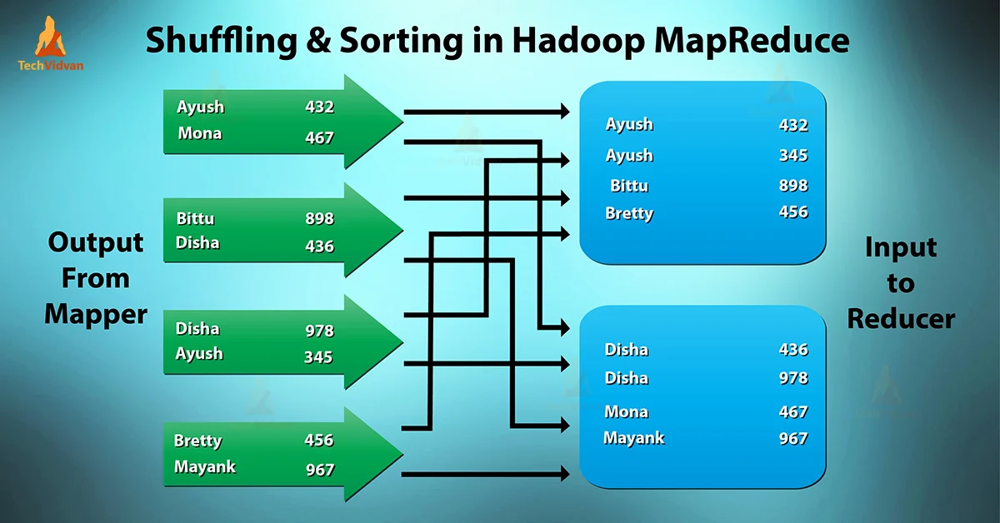

# Data exchange/shuffle

In parallel workloads, we define an exchange (or shuffle) step as that in which all (say X) workers from stage S must 
communicate with all (say Y) workers from stage S + 1. This results in an all-to-all communication pattern involving 
X*Y requests. As the number of requests increases quadratically with the number of parallel workers, the performance of
the shuffle becomes heavily dependent on the throughput of the system.

# Distributed sort

Sorting a dataset globally is both a compute and memory-intensive task, which may be impossible to execute locally for 
"big" datasets (say 20GB or greater). In such cases, parallelization of the sort becomes essential. Luckily, sorting
fits with the MapReduce programming model as following:

## Mappers
1. Each mapper reads a partition of equal size from the input dataset - scan() in [sort.py](sort.py).
2. Determines the destination reducer for each row in the partition, based on some input segments - partition() in [sort.py](sort.py).
3. Communicates the corresponding subpartition to each reducer (including all its assigned rows) - **exchange_write()** in [sort.py](sort.py).

## Reducers
1. Each reducer receives its corresponding subpartitions from all mappers - **exchange_read()** in [sort.py](sort.py).
2. Concatenates all subpartitions and sorts the resulting partition - sort() in [sort.py](sort.py).
3. Outputs its partition to persistent storage - write() in [sort.py](sort.py).

As you may notice, mappers need to know which segment of the data corresponds to each reducer (in the attached picture,
each mapper should know that words in the range [Ayush, Bretty] correspond to reducer 0, and words in the range
[Disha, Mayank] correspond to reducer 1). Such segments should be as load-balanced as possible, resulting in all 
reducers receiving an equivalent amount of data. Thus, we need a sampling stage, prior to the sort, that randomly 
samples random small fragments of the dataset and calculates segments based on the sampled data. The code for the 
sample stage is available at [sample.py](sample.py).

As explained before, the shuffle will consist on the exchange_write and exchange_read operations.

# Parallel sort in FaaS

As cloud functions are not directly addressable (you cannot directly communicate two cloud functions), when using them
as workers (mappers and reducers) you also need an intermediate middleware to perform the shuffle. Mappers will write
their subpartitions to the middleware and reducers will read from it. The easiest way to implement this middleware is 
using a shared object storage (such as AWS S3 or IBM COS), which is scalable and can be provisioned automatically.

The code provided with this document uses an intermediate storage system for shuffling, and is compatible with both
a local storage system and a distributed object storage system in the cloud, thanks to lithops' Storage abstraction.
However, for bursty workloads, we may use faster middlewares for shuffling, such as message-oriented middlewares.

**Your task is to modify the _exchange_write()_ and _exchange_read()_ functions so that, instead of writing to/from a
persistent storage system, they use RabbitMQ queues to manage intermediate data.**

In [sort_test.py](sort_test.py) you have an example execution of a small MapReduce sort, executed sequentially and 
locally, for test purposes. The real implementation is executed with parallel cloud functions workers and a cloud object
storage system.

